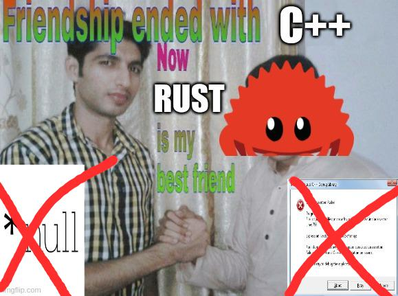
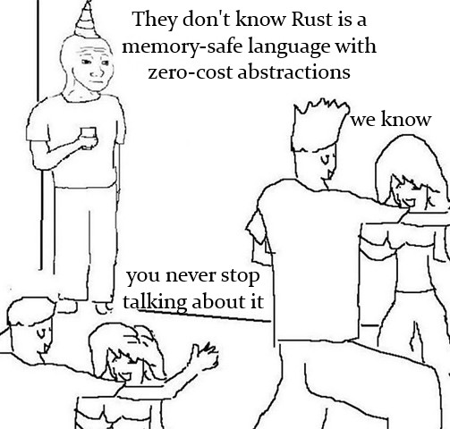
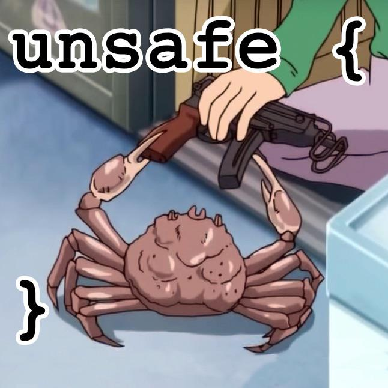
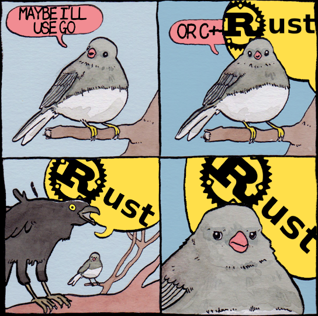
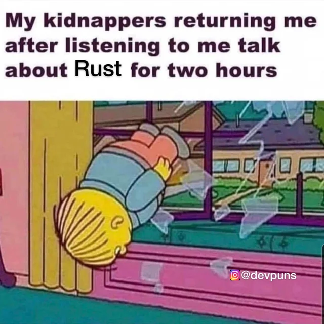

---
# History of Rust
  - Rust was a personal project that began in 2006 by Mozilla employee Graydon Hoare.
  - C++ was difficult to write in.
  - Rust was intended to be a language for highly concurrent and safe systems.
  - Mozilla began to sponsor the project in 2009.
  - The first prealpha release of Rust occurred in Janurary 2012.
  - Rust 1.0 was released on May 15, 2015.

---

# What is Rust?
  - Systems language
  - Statically-type multi paradigm language (functional, OOP, imperative etc.)
  - Focus on Performance, Reliability, and Productivity
  - Safe!
  - Stack Overflow's most loved language

---

# Terms to know

| Word                    | Definition                                                             |
|-------------------------|------------------------------------------------------------------------|
| Pointer                 | Variable that stores the address of another variable                   |
| Free                    | Function that clears memory allocated to a variable                    |
| Garbage Collector       | A feature in PLs that automatically frees memory not needed in Runtime |
| &                       | Operation to view a memory address of a variable                       |
| UB (Undefined Behavior) | When a program runs unexpectedly                                       |

---

# Some Syntax Sugar

| Type  | Meaning                                             |
|-------|-----------------------------------------------------|
| i32   | Signed integer with 32 bit                          |
| u32   | Unsigned integer with 32 bit                        |
| f32   | Double with 32 bytes                                |
| usize | Uses your computer architecture's to determine size |
| char  | UTF-8 - 4 bytes                                     |
| &str  | Slice (String Literal)                              |

---

# Memory Safety
  - A language that can check for errors before runtime
  - Almost no safer operations
  - Ownership (slices, pointers, borrowing):
    - Each value in Rust has a variable that’s called its owner.
    - There can only be one owner at a time.
    - When the owner goes out of scope, the value will be dropped.

---

# Features
  - Compiler Messages
  - Great libraries
  - Toolchain

---

# What you can use Rust for:
  - Writing system software
  - Web projects (ie. Dropbox, OpenDNS, Coursera, Discord)
  - Games (theoretically)
  - Networking due to security and reliability
  - Machine learning (low-level memory control and performance)

---

# Why you shouldn't use Rust
  - Compiler is very slow due to many features
  - APIs are changing frequently due to how new Rust is.
  - Language is difficult for people coming from other languages
  - Code is a lot harder to develop than on c or c++
  - No garbage collector, which isn't for everyone

